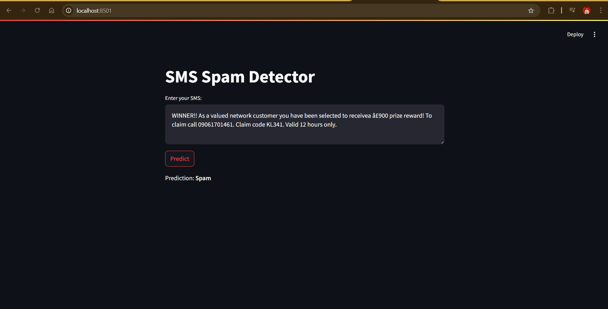
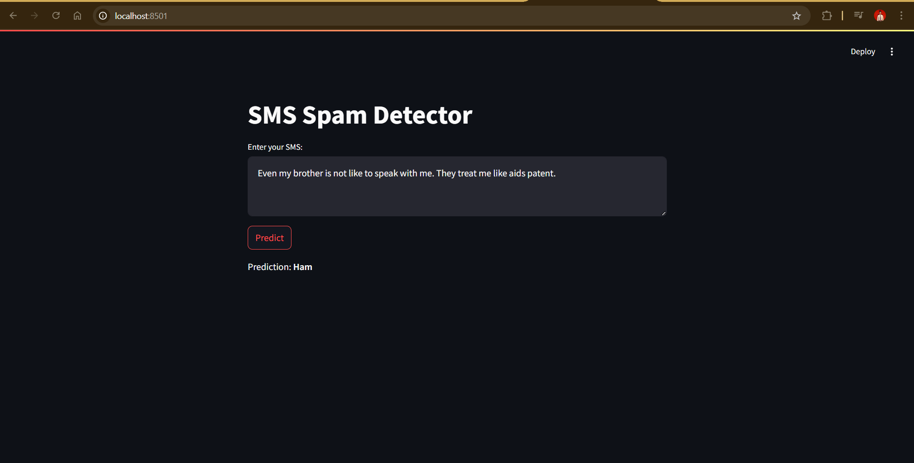

# 📱 SMS Spam Detector (Streamlit App)

A machine learning web app that predicts whether an SMS message is **Spam** or **Ham** using **TF-IDF vectorization** and **Multinomial Naive Bayes**.

## 🚀 Live Demo
Run this project locally with Streamlit or deploy it on Streamlit Cloud.

---

## 📂 Project Structure

sms-spam-detector/
│
├── model.pkl # Trained MultinomialNB model
├── vectorizer.pkl # TF-IDF vectorizer
├── app.py # Streamlit application
├── requirements.txt # Dependencies
└── README.md # Project documentation


---

## 🛠 Installation & Running Locally

1. **Clone this repository**
   ```bash
   git clone https://github.com/your-username/sms-spam-detector.git
   cd sms-spam-detector

Install dependencies:

     1. pip install -r requirements.txt


Run the Streamlit app


     streamlit run app.py

🧠 Model Details
    1. Algorithm: Multinomial Naive Bayes (MultinomialNB)

    2. Feature Extraction: Term Frequency–Inverse Document Frequency (TfidfVectorizer)

    3. Language: Python

    4. Libraries: Streamlit, Scikit-learn, Pandas, Numpy

    5. Dataset: SMS Spam Collection Dataset (UCI Machine Learning Repository)

Workflow:

    1. Preprocess SMS text (lowercasing, removing punctuation, etc.)

    2. Convert text into numerical features using TF-IDF

    3. Train Multinomial Naive Bayes on the transformed data

    4. Save model (model.pkl) and vectorizer (vectorizer.pkl)

    5. Load model in Streamlit to make real-time predictions


📸 Example Predictions

    ## 📸 Screenshot

    Here’s how the app looks when running:

    


    


📜 License
This project is licensed under the MIT License.

✨ Acknowledgments

UCI Machine Learning Repository - SMS Spam Dataset


